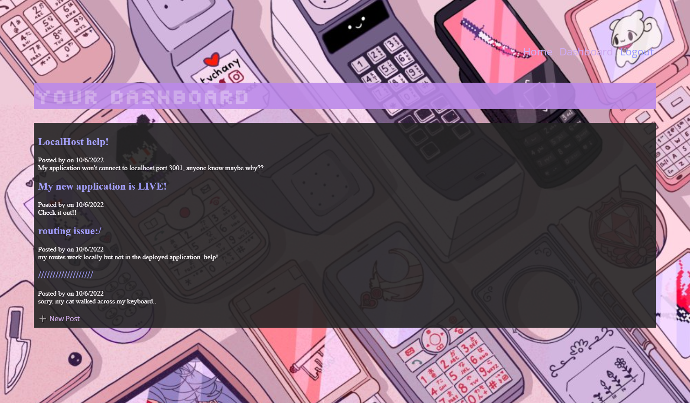

# Model-View-Controller (MVC): Tech Blog

## Description
This is a CMS-style blog site similar to a Wordpress site, where developers can publish their blog posts and comment on other developers’ posts as well. This app follows the MVC paradigm in its architectural structure, uses Handlebars.js as the templating language, Sequelize as the ORM, and the express-session npm package for authentication.

Link to deployed application: https://retro-tech-blog.herokuapp.com

## Mock-Up

The following photo demonstrates the application functionality:

 

### Technical Acceptance Criteria:

* Satisfies all of the preceding acceptance criteria plus the following:

    * Application’s folder structure follows the Model-View-Controller paradigm.

    * Uses the [express-handlebars](https://www.npmjs.com/package/express-handlebars) package to implement Handlebars.js for Views.

## Questions

For details, please visit my [github](https://github.com/sophiadelarosa).
For questions, please [email](mailto:${sophial.delarosa@gmail.com}) me.
